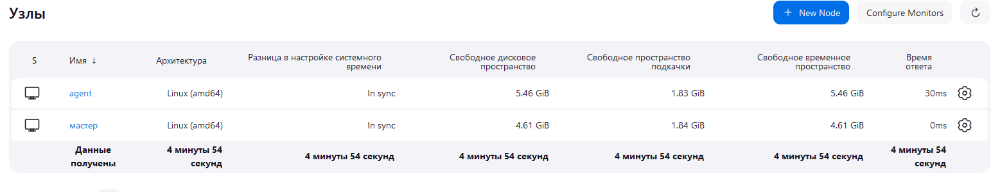

## Подготовка к выполнению

1. Создать две VM: для jenkins-master и jenkins-agent.

2. Установить Jenkins при помощи playbook.

3. Запустить и проверить работоспособность.

4. Сделать первоначальную настройку.

## Основная часть

1. Сделать Freestyle Job, который будет запускать molecule test из любого вашего репозитория с ролью.

2. Сделать Declarative Pipeline Job, который будет запускать molecule test из любого вашего репозитория с ролью.

3. Перенести Declarative Pipeline в репозиторий в файл Jenkinsfile.

>Ответ: [Jenkinsfile](./Jenkinsfile)

4. Создать Multibranch Pipeline на запуск Jenkinsfile из репозитория.

